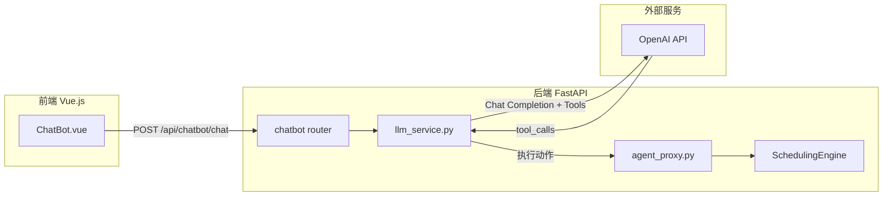

# AI Pilot LLM 集成方案

## 概述

将 AI Pilot 改造为真正的 LLM 聊天机器人，通过 OpenAI API 实现智能对话，同时保留现有排程功能（通过 Function Calling 实现）。

## 架构概览



## 1. 后端改造

### 1.1 新建 LLM 服务模块

创建 `backend/app/services/llm_service.py`：
- 封装 OpenAI Chat Completion API 调用
- 管理对话历史（system prompt + messages）
- 定义 Tools（Function Calling）用于调用排程功能
- 处理 tool_calls 并执行对应动作

Tools 定义示例：

```python
TOOLS = [
    {
        "type": "function",
        "function": {
            "name": "find_delayed_orders",
            "description": "查询当前延误/逾期的订单列表",
            "parameters": {"type": "object", "properties": {}}
        }
    },
    {
        "type": "function", 
        "function": {
            "name": "run_heuristic",
            "description": "运行启发式排程",
            "parameters": {
                "type": "object",
                "properties": {
                    "display_start_date": {"type": "string", "description": "显示区间开始日期 YYYY-MM-DD"},
                    "display_end_date": {"type": "string", "description": "显示区间结束日期"},
                    "resource_names": {"type": "array", "items": {"type": "string"}}
                }
            }
        }
    },
    # cancel_plan, save_plan 等
]
```

### 1.2 添加配置管理

创建 `backend/app/config.py`：
- 从环境变量读取 `OPENAI_API_KEY`
- 可配置模型名称 `OPENAI_MODEL`（默认 `gpt-4o`）
- 可配置 API Base URL（支持代理/自建端点）

### 1.3 修改现有文件

- `backend/app/services/agent_proxy.py`：
  - 保留 `_execute_action` 函数作为 Tool 执行入口
  - 删除正则意图检测逻辑（由 LLM 替代）

- `backend/app/routers/chatbot.py`：
  - 调用 `llm_service` 而非直接调用 `agent_proxy.chat`

- `backend/app/schemas.py`：
  - `ChatRequest` 增加可选的 `conversation_id` 字段（支持多轮对话）

### 1.4 添加依赖

在 `backend/requirements.txt` 添加：

```
openai>=1.0.0
```

## 2. 对话管理

### 2.1 System Prompt

```
你是 APS（高级计划排程系统）的 AI 助手。你可以帮助用户：
- 查询延误订单
- 运行启发式排程（需要参数：显示区间、资源、日期等）
- 取消或保存排程计划
- 回答关于排程系统的问题

请用简洁专业的语言与用户交流。
```

### 2.2 会话状态

使用内存缓存（dict）存储短期会话历史，key 为 `conversation_id`：
- 保留最近 N 条消息（建议 20 条）
- 超时自动清理（如 30 分钟无活动）

## 3. 前端改造（可选优化）

`frontend/src/components/ChatBot.vue` 当前实现已可支持，可选优化：
- 添加 `conversationId` 状态，重新打开抽屉时保持上下文
- 显示 LLM 正在"思考"时的流式效果（需后端支持 SSE）

## 4. 环境配置

用户需设置环境变量：

```bash
export OPENAI_API_KEY="sk-..."
export OPENAI_MODEL="gpt-4o"  # 可选，默认 gpt-4o
export OPENAI_BASE_URL=""      # 可选，自定义 API 端点
```

## 关键代码改动

| 文件 | 操作 | 说明 |
|-----|------|-----|
| `backend/app/services/llm_service.py` | 新建 | LLM 调用 + Function Calling |
| `backend/app/config.py` | 新建 | 环境变量配置 |
| `backend/app/services/agent_proxy.py` | 修改 | 简化为动作执行模块 |
| `backend/app/routers/chatbot.py` | 修改 | 集成 LLM 服务 |
| `backend/app/schemas.py` | 修改 | 添加 conversation_id |
| `backend/requirements.txt` | 修改 | 添加 openai 依赖 |

## 实施步骤

1. 创建 `config.py` 配置模块（OPENAI_API_KEY 等环境变量）
2. 创建 `llm_service.py`（OpenAI 调用、Tools 定义、会话管理）
3. 重构 `agent_proxy.py` 为纯动作执行模块
4. 修改 `chatbot.py` 路由集成 LLM 服务
5. 更新 `schemas.py` 添加 conversation_id
6. 更新 `requirements.txt` 添加 openai 依赖
