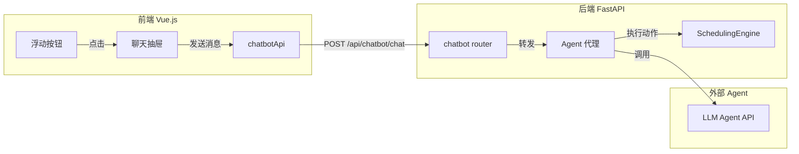

# 聊天机器人集成方案

## 概述

在全局添加浮动聊天按钮和抽屉式聊天界面，通过后端 API 连接 Agent，实现策略调整、启发式排程、计划管理和延误订单查询功能。

## 架构概览



## 前端实现

### 1. 创建聊天机器人组件

新建 `frontend/src/components/ChatBot.vue`：
- 浮动按钮：固定在右下角，点击打开/关闭抽屉
- 抽屉界面：包含消息列表、输入框、发送按钮
- 消息渲染：支持用户消息和机器人回复，机器人回复可包含操作结果反馈

### 2. 在 App.vue 中集成

在 `frontend/src/App.vue` 的主布局中引入 `ChatBot` 组件：
- 放在 `el-config-provider` 内部、`router-view` 同级
- 仅在登录后显示（非登录页）

### 3. 添加 API 接口

在 `frontend/src/api/index.js` 中新增：

```javascript
export const chatbotApi = {
  sendMessage: (message, context = {}) => api.post('/chatbot/chat', { message, context }),
  getHistory: () => api.get('/chatbot/history')
}
```

### 4. 添加国际化文本

在 `frontend/src/i18n/zh-CN.js` 和 `frontend/src/i18n/en-US.js` 中添加聊天相关文案。

## 后端实现

### 1. 创建 Chatbot Router

新建 `backend/app/routers/chatbot.py`：

```python
@router.post("/chat")
async def chat(request: ChatRequest, db: Session = Depends(get_db)):
    """
    处理聊天消息，转发给 Agent 并执行返回的动作
    
    Agent 可返回的动作类型：
    - adjust_strategy: 调整策略参数
    - run_heuristic: 运行启发式排程
    - cancel_plan: 取消计划
    - save_plan: 保存计划
    - find_delayed_orders: 查找延误订单
    """
```

### 2. 创建 Agent 代理服务

新建 `backend/app/services/agent_proxy.py`：
- 负责与外部 Agent API 通信
- 解析 Agent 返回的动作指令
- 调用对应的 SchedulingEngine 方法

### 3. 添加数据模型

在 `backend/app/schemas.py` 中添加：

```python
class ChatRequest(BaseModel):
    message: str
    context: Optional[dict] = None

class ChatResponse(BaseModel):
    reply: str
    action_result: Optional[dict] = None
    action_type: Optional[str] = None
```

### 4. 注册路由

在 `backend/app/main.py` 中注册 chatbot router。

## Agent 动作映射

| 用户意图 | Agent 动作 | 后端方法 |
|---------|-----------|---------|
| 调整策略 | `adjust_strategy` | 返回策略配置供前端应用 |
| 运行启发式 | `run_heuristic` | `engine.auto_plan()` |
| 取消计划 | `cancel_plan` | `engine.cancel_plan()` |
| 保存计划 | `save_plan` | `engine.save_plan()` |
| 查找延误订单 | `find_delayed_orders` | 新增 `engine.get_delayed_orders()` |

## 关键文件

| 文件 | 变更类型 | 说明 |
|-----|---------|-----|
| `frontend/src/components/ChatBot.vue` | 新建 | 聊天组件（按钮+抽屉） |
| `frontend/src/App.vue` | 修改 | 引入 ChatBot 组件 |
| `frontend/src/api/index.js` | 修改 | 添加 chatbotApi |
| `frontend/src/i18n/zh-CN.js` | 修改 | 添加中文文案 |
| `frontend/src/i18n/en-US.js` | 修改 | 添加英文文案 |
| `backend/app/routers/chatbot.py` | 新建 | 聊天 API 路由 |
| `backend/app/services/agent_proxy.py` | 新建 | Agent 代理服务 |
| `backend/app/schemas.py` | 修改 | 添加请求/响应模型 |
| `backend/app/main.py` | 修改 | 注册路由 |
| `backend/app/scheduler/engine.py` | 修改 | 添加 get_delayed_orders 方法 |

## 实施步骤

1. 创建 ChatBot.vue 组件（浮动按钮 + 抽屉界面）
2. 在 App.vue 中集成 ChatBot 组件
3. 添加 chatbotApi 前端接口
4. 添加中英文国际化文案
5. 添加 ChatRequest/ChatResponse 数据模型
6. 创建 agent_proxy.py Agent 代理服务
7. 创建 chatbot.py 后端路由
8. 在 engine.py 中添加 get_delayed_orders 方法
9. 在 main.py 中注册 chatbot 路由
