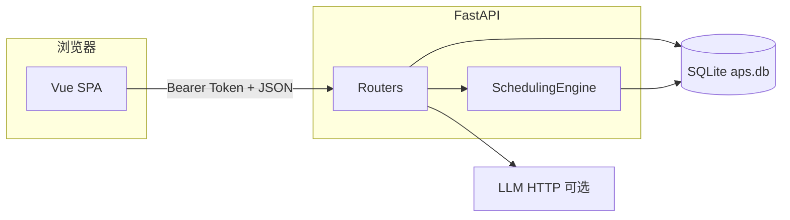
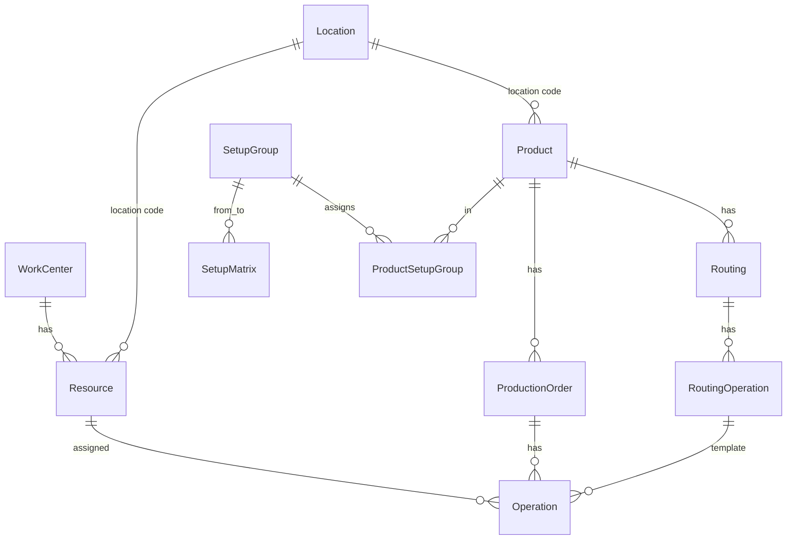

# APS 排程系统 — 系统功能说明

本文档面向产品、实施、开发与测试人员，描述当前代码实现下的**系统架构**、**数据库结构**、**界面与字段要点**、**KPI/利用率等计算口径**及 **REST API** 索引。完整请求/响应契约以运行后端后的 Swagger（`/docs`）及 `backend/app/schemas.py` 为准。

---

## 1. 概述与范围

### 1.1 系统定位

工序级高级计划与排程（APS），参考 SAP PPDS 思路：维护主数据与订单，在有限产能与工艺顺序约束下进行正向/逆向排程，支持甘特可视化、拖拽调整、KPI 与详细计划表（DS）视图。

### 1.2 术语

| 术语 | 含义 |
|------|------|
| 计划订单 | `order_type=planned`，时间可随排程变化 |
| 生产订单 | `order_type=production`，可带确认起止时间 |
| 工艺路线工序 | `routing_operations`，产品标准工艺 |
| 工序实例 | `operations`，订单展开后的可排程单元 |
| DS / 详细计划表 | 按位置、资源、产品等多维筛选的主计划界面及相关子页 |
| 预览排程 | 写入内存 `ScheduleCache`，需「保存计划」才持久化到库 |

---

## 2. 系统架构

### 2.1 逻辑分层

| 层 | 技术 | 职责 |
|----|------|------|
| 展示层 | Vue 3、Vue Router、Pinia、Element Plus、ECharts、dhtmlx-gantt | 页面、状态、图表与甘特 |
| API 网关（开发） | Vite `proxy` | 将 `/api` 转发到后端 |
| 应用层 | FastAPI、`backend/app/routers/*` | 认证、主数据、订单、排程、导入导出、聊天 |
| 领域层 | `SchedulingEngine`、`scheduler/algorithms.py`、`constraints.py` | 排程、约束校验、KPI/利用率 |
| 服务层 | `services/working_segments.py`、`planned_operation_times.py`、`rest_breaks.py` 等 | 班次、可排产时段、休息 |
| 持久层 | SQLAlchemy ORM、`backend/aps.db`（SQLite） | 实体存储 |
| 可选外部 | OpenAI 兼容 HTTP（Gemini 等） | 对话助手 |

### 2.2 进程与部署（开发默认）

- **前端**：`npm run dev`，Vite 默认端口 **3000**，`vite.config.js` 将 `/api` 代理到 `http://127.0.0.1:8000`。
- **后端**：`uvicorn app.main:app --reload --port 8000`，提供 REST 与 `/docs`。
- **生产**：可将 `frontend` 构建为静态资源，由 Nginx 等托管，并把 `/api` 反代到 uvicorn；本文不展开运维细节。

### 2.3 请求与数据流（示意）

### 2.4 横切能力

- **CORS**：`backend/app/main.py` 中对前端跨域放开（开发友好；生产宜收紧）。
- **认证**：`Authorization: Bearer <token>`；Token 由 `auth` 模块签发并存于进程内字典 `active_tokens`（非 JWT，重启失效）。
- **启动**：`lifespan` 中 `init_db()`、初始化默认管理员（见 `auth.init_default_user`）。

### 2.5 版本参考

- 前端依赖见 `frontend/package.json`（如 Vue ^3.4、Element Plus ^2.5、dhtmlx-gantt ^8、ECharts ^5）。
- 后端依赖见 `backend/requirements.txt`（如 FastAPI 0.109、SQLAlchemy 2.0、openpyxl）。

---

## 3. 数据库结构

### 3.1 连接与文件位置

- 连接串：`sqlite:///{backend目录}/aps.db`（`backend/app/database.py` 中 `DB_PATH`）。
- SQLite 使用 `check_same_thread=False` 以适配 FastAPI 多线程请求。

### 3.2 初始化与结构演进

`init_db()` 顺序（摘要）：

1. `Base.metadata.create_all` 创建 ORM 定义的表。
2. `_sqlite_migrate_columns`：对**已有库**执行 `ALTER TABLE ... ADD COLUMN`（`create_all` 不会改旧表结构）。
3. `_sqlite_locations_master_table`：确保 `locations` 表存在。
4. `_migrate_legacy_default_location_code`：历史 `DEFAULT` 位置码迁移。
5. `_bootstrap_location_catalog`：主位置码、从业务表反补 `locations`、回填订单等 `location`。
6. `_sqlite_routing_operations_work_center_nullable` / `_sqlite_resources_work_center_nullable`：可空外键（SQLite 重建表）。
7. `_sqlite_resources_drop_efficiency_column`：删除旧列 `efficiency`，迁移到 `utilization_percent`。

**说明**：若需「权威 DDL」，应以当前 `aps.db` 的 `sqlite_master` 为准；ORM 与迁移脚本为工程内真相来源。

### 3.3 表清单

| 表名 | 用途 | 主键 | 主要外键 |
|------|------|------|----------|
| users | 登录用户 | id | — |
| locations | 位置主数据 | code | — |
| work_centers | 工作中心 | id | — |
| resources | 资源（机台/人等） | id | work_center_id |
| shifts | 资源班次 | id | resource_id |
| products | 产品 | id | — |
| routings | 工艺路线 | id | product_id |
| routing_operations | 路线工序 | id | routing_id, work_center_id?, resource_id? |
| production_orders | 计划/生产订单 | id | product_id |
| operations | 工序实例 | id | order_id, routing_operation_id, resource_id? |
| setup_groups | 切换组 | id | — |
| product_setup_groups | 产品—切换组 | id | product_id, setup_group_id, work_center_id? |
| setup_matrix | 切换时间矩阵 | id | from/to setup_group, resource_id?, work_center_id? |

### 3.4 枚举存储（字符串列）

| 概念 | 取值示例 | 存储表 |
|------|----------|--------|
| 订单类型 | `planned`, `production` | production_orders.order_type |
| 订单状态 | `created`, `scheduled`, `in_progress`, `completed`, `cancelled` | production_orders.status |
| 工序状态 | `pending`, `scheduled`, `in_progress`, `completed` | operations.status |

### 3.5 业务清空顺序（与导入依赖）

后端 `data_management` 按子表优先删除，典型顺序为：`operations` → `production_orders` → … → `locations`（详见 `CLEAR_STEPS`）。勾选某类型清空时，会按 `CLEAR_EXPANSION` 扩展关联类型，避免外键残留。

### 3.6 内存排程缓存与数据库

`scheduler/cache.py` 单例 `schedule_cache`：**预览**启发式/重排结果先入内存；`save-plan` 写入数据库，`discard-plan` 丢弃。`gantt-data`、`kpi`、`utilization` 在存在未保存缓存时会合并缓存工序时间（与 `SchedulingEngine` 实现一致）。

### 3.7 ER 关系（核心）

---

## 4. 环境与访问

- **Python** 3.9+、**Node** 18+（与 README 一致）。
- 初始化演示数据：`backend` 下执行 `python init_demo_data.py`。
- 后端：`uvicorn app.main:app --reload --port 8000`。
- 前端：`cd frontend && npm install && npm run dev` → 浏览器 `http://localhost:3000`。
- **OpenAPI**：`http://localhost:8000/docs`。

---

## 5. 全局 UI / 字体与主题

| 项 | 说明 |
|----|------|
| 字体 | `frontend/src/styles/main.scss` 引入 **Roboto**，`body` 上 `font-size: 14px`，`line-height: 1.5` |
| 色与圆角 | Material 3 风格 SCSS 变量（如 `$m3-primary`、`$m3-shape-md`） |
| 组件库 | Element Plus + 中文 locale（`main.js`） |
| 甘特 | `dhtmlx-gantt` 自带样式 |
| 应用壳 | `App.vue`：侧栏宽 **280px**，Logo、分组菜单、用户下拉（个人资料、改密、数据管理、退出） |
| 聊天 | `ChatBot.vue` 全局挂载（非登录页） |

---

## 6. 认证与权限

### 6.1 前端

- 路由 `meta.requiresAuth`：未带 `localStorage.token` 跳转 `/login`。
- `meta.requiresAdmin`：非管理员访问 `/data-management` 时提示并回 `/dashboard`。
- Axios 拦截器：请求附加 `Authorization: Bearer`；401 清除 token 并跳转登录（`frontend/src/api/index.js`）。

### 6.2 后端 API（`/api/auth`）

| 方法 | 路径 | 说明 |
|------|------|------|
| POST | /login | 表单用户名密码，返回 token 与用户信息 |
| POST | /logout | 注销 token |
| GET | /me | 当前用户 |
| PATCH | /profile | 更新资料（姓名、邮箱、部门、日期/时间格式、时区等） |
| POST | /change-password | 修改密码 |

密码存储为 **SHA256** 哈希（非 bcrypt）；Token 为进程内随机串（生产建议改为 JWT + Redis 等）。

---

## 7. 前端路由与菜单对照

侧栏菜单以 `App.vue` 为准；下列路由**已注册**但可能不在侧栏（需直达 URL 或自行加入口）：

| 路径 | 组件 | 侧栏 | 说明 |
|------|------|------|------|
| /login | Login | — | 登录 |
| /dashboard | Dashboard | KPI 仪表板 | 筛选 + KPI + 利用率图 + 资源表 |
| /ds | DSView | 详细计划表 | 主计划视图 |
| /ds-scheduling | DSSchedulingView | — | **占位页**（仅标题与说明，实际排程在 `/ds`） |
| /ds-resource | DSResourceView | 主数据-资源 | DS 风格资源表 + Excel 工具栏 |
| /master-data/shifts | ShiftsView | 班次 | |
| /ds-product | DSProductView | 产品 | |
| /ds-routing | DSRoutingView | 工艺路线 | |
| /ds-setup-matrix | DSSetupMatrixView | 切换矩阵 | |
| /orders | DSOrdersView | 生产订单 | |
| /ds-orders | DSOrdersView | — | 与 /orders 同组件 |
| /master-data/locations | Locations | 子菜单未列时可直链 | 位置主数据 |
| /master-data/work-centers | WorkCenters | 侧栏未挂 | 工作中心 |
| /master-data/resources | Resources | 侧栏未挂 | 经典资源维护 |
| /master-data/products | Products | 侧栏未挂 | 经典产品 |
| /master-data/routings | Routings | 侧栏未挂 | 经典工艺路线 |
| /master-data/setup-matrix | SetupMatrix | 侧栏未挂 | 经典切换矩阵 |
| /gantt | GanttView | 未挂 | 订单甘特 |
| /resource-view | ResourceView | 未挂 | 资源甘特 |
| /data-management | DataManagement | 管理员下拉 | Excel 清空 |
| /profile | ProfileView | 用户下拉 | 个人设置 |

---

## 8. 功能模块详解（页面风格 · 筛选 · 字段 · 操作）

以下描述与当前 Vue 页面及 i18n 文案一致；**界面文字**以运行时的语言包为准（中文键名在括号中给出 i18n 路径或页面硬编码原文）。

### 8.0 共通页面模式

- **主数据类页面**（`master-data-page`）：顶栏 `page-header`（左侧 `h1` + 图标，右侧 `header-actions` 按钮组）；主体多为 **白底 `el-card` + `el-table` stripe**。
- **详细计划表**（`DSView`）：**全高白底** `height: calc(100vh - 80px)`，**两行工具栏**（上筛选、下操作），下方为可多块纵向堆叠的图表区，块间 **8px 高灰色分隔条**（`#f5f7fa`，悬停变深）。
- **工具栏标签**：筛选行标签 `14px`、`#606266`，必填项标 **红色星号**（`#f56c6c`）。DS 操作区 **描边按钮** `btn-outline`：白底、深字、`#dcdfe6` 边框。
- **Excel 工具条**（`DataExcelToolbar`）：在多个页面标题右侧出现；单实体时两个按钮「下载模板」「上传数据」；多实体时下拉选择类型。仅接受 `.xlsx`，上传成功后触发父页 `imported` 回调刷新列表。

---

### 8.1 登录页 `/login`（`Login.vue`）

| 项目 | 说明 |
|------|------|
| **风格** | 全屏居中卡片；背景为浮动几何色块；中间 **登录卡片** + Logo + 标题/副标题（`login.title`、`login.subtitle`）。 |
| **字段** | 用户名、密码（`size="large"`，前缀图标 User/Lock）；「记住我」复选框。 |
| **操作** | 主按钮「登录」提交；回车可触发；底部展示默认账号提示（`login.defaultAccount`）。 |
| **逻辑** | 调用 `POST /api/auth/login`；成功写入 `localStorage` token/user，跳转首页。 |

---

### 8.2 个人资料 `/profile`（`ProfileView.vue`）

| 项目 | 说明 |
|------|------|
| **布局** | `page-header` + `el-card`（`shadow="never"`），表单 `label-width="140px"`。 |
| **字段** | 用户名（禁用）；姓名、邮箱、部门（均 `maxlength=100` + 字数统计）；**日期格式**下拉（与后端 `ALLOWED_DATE_FORMATS` 一致）；**时间格式** `24h`/`12h`；**时区**（优先 `Intl.supportedValuesOf('timeZone')`）。 |
| **操作** | 「保存」→ `PATCH /api/auth/profile`；成功后同步 `userDisplayPrefs` 等。 |

---

### 8.3 KPI 仪表板 `/dashboard`（`Dashboard.vue`）

| 项目 | 说明 |
|------|------|
| **风格** | 标题行带 `TrendCharts` 图标；筛选与「刷新视图」同排 **栅格**（`el-row`/`el-col`）；KPI 为四列 **KPICard**；下方两列 **el-card** 内 **ECharts**；底部 **资源利用明细表**。 |
| **筛选条件** | **日期区间**（必填星号，`daterange`，`YYYY-MM-DD`，带快捷项）；**位置**（多选，表头可「全选位置」）；**资源**（多选，`clearable=false`，表头「全选资源」）。变更后刷新 KPI 与图表。 |
| **请求参数** | 同一区间同时作为：`due_date_start/end`（订单 KPI、平均提前期）与 `schedule_date_start/end`（资源利用率、每日负荷、明细表）；`product_locations` 与 `resource_locations` 均传所选位置代码列表；`resource_ids` 为所选资源。 |
| **KPI 卡片** | 订单总数；已排程订单数；准时率（% ，颜色随阈值变化）；平均提前期（小时，1 位小数）。数据来自 `GET /api/scheduling/kpi`。 |
| **图表** | 左：**资源利用率**柱状图；右：**每日产能负荷**（按日聚合）。 |
| **明细表列** | 资源名称、工作中心、总产能(小时)、已排程(小时)、利用率（**进度条** + 百分比文字，`Math.min(%,100)` 作为条长）。 |
| **操作** | 「刷新视图」按钮，`loading` 状态防重复提交。 |

#### 8.3.1 指标取值与后端计算逻辑（`SchedulingEngine.get_kpi_data`）

以下均受 **交期区间 / 排程窗口 / 位置 / 资源** 过滤影响，细节与文档第 9.4 节一致；此处按**仪表板展示**归纳。

| 界面元素 | 数据来源字段 | 取值 / 计算逻辑 |
|----------|----------------|-----------------|
| **订单总数** | `order_kpi.total_orders` | 在 **交期区间**（`due_date_*`）过滤后的订单数量；再与位置、资源过滤求交。 |
| **已排程订单数** | `order_kpi.scheduled_orders` | 计划订单：`status=scheduled` 且不存在 `pending` 工序；生产订单：`confirmed_end` 非空；两类取并集去重。**不含**仅靠预览缓存但未纳入上述口径的情况以引擎实现为准。 |
| **准时率** | `order_kpi.on_time_rate` | 仅在「已排程」集合上统计：每单取**末道工序**完工时间（优先缓存 `scheduled_end` → 库 `scheduled_end` → `confirmed_end` → 否则交期日 08:00）；与 `due_date` 比较，`准时单数 / 参与统计单数 × 100`，1 位小数。**前端**：若 `scheduled_orders === 0`，卡片显示 `--`，避免误导。 |
| **延误 / 准时单数** | `delayed_orders` / `on_time_orders` | 上表逻辑的二元计数（图表不直接展示，供理解）。 |
| **平均提前期** | `avg_lead_time_hours` | 仅统计与「已排程」**同一订单集合**（含缓存工序时间并集）；每单：`max(工序结束) - min(工序开始)`（小时），无工序时间时可用生产单 `confirmed` 区间或按交期与 `run_time` 估算；再对订单取算术平均，1 位小数。**前端**：`scheduled_orders === 0` 时显示 `--`。 |
| **资源利用率（柱状图）** | `resource_utilization[].utilization_percent` | 每资源：`scheduled_hours / total_capacity_hours × 100`。`total_capacity` = 日可排产小时 × 窗口天数；`scheduled_hours` = 与窗口重叠的已排程段与**可排产时段**交集小时累加（含缓存；可含生产单确认区间按工序分摊），**不含**纯待排程虚拟占用。 |
| **柱状图颜色** | ECharts `itemStyle` | 利用率 ≥90% `#d93025`；≥70% `#f9ab00`；否则 `#1e8e3e`（与 `Dashboard.vue` 中 M3 常量一致）。 |
| **每日产能负荷** | `capacity_load_by_day` | 按**自然日**汇总：该日所有选中资源上「实际占用」有效工时（算法与资源利用率同源，按天切分累加）；每日返回 `used_capacity`、`total_capacity`（当日全体选中资源日产能之和）、`utilization`。 |
| **负荷图系列** | 柱状 + 折线 | **已用产能**：蓝色柱 `#1a73e8`；**总产能**：灰色虚线 `#444746`。横轴为日期键 `MM-DD`。 |
| **资源利用详情表** | 同 `resource_utilization` | 与柱状图同一数组；进度条颜色函数与柱状图一致（≥90% 红、≥70% 黄、否则绿）。 |

---

### 8.4 详细计划表 `/ds`（`DSView.vue`）

| 项目 | 说明 |
|------|------|
| **页面结构** | **第一行工具栏** `toolbar-filters`：筛选器横向排列，间距 16px，底边 `#e4e7ed`。 **第二行** `toolbar-actions`：左「选择图表」多选；中 **缩放按钮组**（放大/缩小图标）、**缩放粒度下拉**（小时 / 4小时 / 天 / 周 / 月）、刷新、**警报**下拉（订单延误预警、物料短缺预警等）、**策略**（打开策略对话框）、**取消计划**、**自动计划**下拉（启发式 / 优化器）、**丢弃计划**（仅 `hasUnsavedChanges` 时显示）、**保存计划**（有未保存时带 `*` 与 **脉冲高亮动画** `btn-highlight`）、**日志**；右 **图例**（计划订单色块、生产订单色块、换产色块）。 |
| **筛选条件（带 * 必填）** | **展示区间** `daterange`，宽 280px，`value-format=YYYY-MM-DD`；**位置** 多选（表头勾选 = 全选主数据位置）；**资源名称** 多选不可清空，表头 **全选** + **仅瓶颈资源** 勾选联动列表；**产品** 多选可选。筛选与 `useDSFiltersStore` 同步并 **本地持久化**（离开页面前 `onBeforeUnmount` 保存）。 |
| **选择图表** | 多选：`resource` 资源甘特表、`product` 产品表、`utilization` 资源利用率图；未选中的整块面板不显示；多选时面板间有 **可拖拽分隔条**（视觉提示）。 |
| **主显示区** | **资源**：`SimpleGanttTable`；**产品**：`SimpleProductTable`；**利用率**：`UtilizationChart`。标题行显示当前块条目数量。 |
| **主要操作与 API** | 刷新：重拉甘特/利用率；自动计划：`POST /api/scheduling/auto-plan`；取消/保存/丢弃：`cancel-plan` / `save-plan` / `discard-plan`；缓存状态：`cache-status`。拖拽工序：`reschedule-operation` 等（见 store）。 |
| **数据共享** | `dsFilters` 供 **DS 工艺路线** 等子页消费；详细计划表所选产品会在 **工艺路线页** 顶部显示过滤提示条（见 **8.7**）。 |

#### 8.4.1 各图中的色块颜色（任务条与图例）

**工具栏右侧图例**（`DSView.vue`，小方块 14×14px）：计划订单 `#409EFF`；生产订单 `#909399`；切换准备 `#E6A23C`。

**资源甘特 `SimpleGanttTable`**（条上为渐变，与图例略有色差属正常）：

| 类型 | 样式类 | 颜色 / 效果 |
|------|--------|-------------|
| 计划订单工序 | `planned-bar` | 渐变 `#1a73e8` → `#4285f4` |
| 生产订单工序 | `production-bar` | 渐变 `#6B7280` → `#9CA3AF` |
| 订单/资源分组行汇总条 | `project-bar` | 渐变 `#4285f4` → `#5a9cf5` |
| 换产/切换 | `changeover-bar` | 渐变 `#F59E0B` → `#D97706`，**2px 虚线边框** `#92400E` |
| 已排程计划单（库中已保存） | `scheduled-order` | 在以上基础上增加 **2px 实线红框** `#f56565`（`is_preview` 的预览条不加红框） |

**产品甘特 `SimpleProductTable`**：计划/生产/换产与上表类似；分组行 `project-bar` 为 **绿色** 渐变 `#67c23a` → `#85ce61`（与资源视图蓝色分组条区分）。

**利用率图**：见下节。

#### 8.4.2 资源利用率视图（`UtilizationChart`）设计与取值

**布局**：左侧固定宽 **460px**（资源名称列 380px + 产能刻度列 80px），表头/内容区背景 `#f5f7fa`；右侧为可横向滚动的时间轴与柱状区。每资源一行 **高度 80px**，行底 `#ebeef5` 分隔；行内背景为浅灰竖带（约 33% 宽重复）便于读刻度。

**左侧刻度**：纵轴语义为 **0%～130%**（文案刻度 130/100/80/50/0），与柱高换算一致。

**时间轴**：与 `SimpleGanttTable` 类似按 `dateRange` 生成自然日；`zoomLevel` 决定 **每日像素宽度**（0→480px/天，1→240px，2→120px，3→40px，4→20px）及小时刻度密度。

**每个时间桶（`time_slots` 元素）**：

- 后端 `GET /api/scheduling/utilization` 返回每资源 `time_slots[]`，字段含 `start`、`end`、`utilization`（**0～1+ 的比率**，可大于 1 表示超载）。
- **柱高**：`utilization` 按 **0～1.3 线性映射** 为行高百分比：`height = min(max(u,0), 1.3) / 1.3 × 100%`；`u≤0` 时固定 **2px** 占位。
- **柱色**：`0 < u ≤ 1` → **绿色** 渐变 `#52c41a`～`#95de64`（`normal`）；`u > 1` → **红色** 渐变 `#f5222d`～`#ff7875`（`overload`）；`u === 0` → **浅灰** `#e4e7ed`（`empty`，约 2px）。
- **Tooltip**：`利用率: (utilization×100).toFixed(1)%`。
- **当前时刻线**：红色半透明竖线 `rgba(229,57,53,0.4)`，顶端小圆点。

**与后端一致**：桶内分子为「已排产有效工时」与可排产时段交集；分母为「该资源全天标准可用产能（小时）」，与 KPI/启发式使用同一套日产能口径（见第 9.5 节及 `engine.get_utilization_data`）。

#### 8.4.3 策略对话框（`strategyDialogVisible`，宽 600px）

点击 **「策略」** 仅打开配置；**确认** 将当前排序规则写入本地 `currentStrategy` 并提示保存成功（**不直接调用排程 API**）。真正跑启发式时会把 **同一份 `strategyForm`** 打包进 `optimizer_config` 一并提交。

| 表单项 | 可选值（当前 UI） | 说明（与 `zh-CN` 文案 `dsView.*Hint` 一致） |
|--------|-------------------|---------------------------------------------|
| 排序规则 | 订单优先级 | 决定订单排程顺序，优先级高的先排。映射到算法侧 `PRIORITY`。 |
| 计划模式 | 查找槽位 | 在资源已有排程中搜索足够大的空闲段；对应 **有限产能**（`planning_mode == '查找槽位'` → `use_finite_capacity`）。 |
| 计划方向 | 向前 / 向后 | 向前：从期望日期向**未来**搜；向后：从交期向**过去**搜。 |
| 期望日期 | 当前日期 / 指定日期 | 当前日期：用系统时间作锚点；指定日期：再选日期，作为排程起点相关逻辑。 |
| 订单内部关系 | 不考虑 / 始终考虑 | 不考虑：只动选中资源上的工序；始终考虑：维护同单其它工序时间关系并可能联动调整。 |
| 子计划模式 | 根据调度模式调度相关操作 / 以无限方式调度相关操作 | 关联工序用相同有限产能模式，或改为**无限产能**排关联工序。 |
| 计划出错的操作 | 立即终止 | 某一工序无法排程时**整单停止**（后端 `StableForwardScheduler` 行为）。 |

表单项下方提示字：**12px，`#909399`**。

#### 8.4.4 「自动计划」操作流

1. 用户点击 **自动计划** 下拉：**启发式** → 打开 **启发式对话框**（400px）；**优化器** → 打开 **优化器配置**（500px，滑块权重 + 时间限制秒）。  
2. 点 **执行** 前：`handleHeuristicExecute` / `handleOptimizerExecute` 会校验 DS 筛选（日期、位置、资源等非空）。  
3. 调用 `schedulingStore.autoPlan` → `POST /api/scheduling/auto-plan`，body 含 `plan_type`、`heuristic_id`（启发式）、`optimizer_config`（完整策略包或优化器参数）、`resource_ids`（当前选中资源）。  
4. 返回后：更新 `has_unsaved_changes`、写入 **计划日志**（供「日志」按钮查看）、**刷新甘特** `fetchGanttData`。  
5. 启发式失败时可能仍刷新甘特以展示已排部分；成功关闭子对话框并提示。

**启发式提交时的固定/附加配置**（`handleHeuristicExecute` 内写死部分）：`finite_capacity: true`、`resolve_backlog`、`resolve_overload`、`preserve_scheduled: true`、`planning_horizon: 90`、`schedule_selected_resources_only: true`，以及展示区间 `display_start_date` / `display_end_date`（与页面日期范围一致）。

#### 8.4.5 启发式运行逻辑（后端 + 前端入口）

- **前端默认算法**：`heuristicForm.selected = 'stable_forward'`（稳定向前计划）。  
- **`heuristic_id == 'stable_forward'`**：后端 `SchedulingEngine._run_stable_forward_scheduling`：构造 `StableForwardScheduler`，读取 `optimizer_config` 中排序规则、方向、期望日期模式、订单内部关系、子计划模式、出错处理等（见引擎内文档字符串，与 8.4.3 表一致）；订单集为 **计划订单** 且状态 `created/scheduled`，并按展示区间等过滤；结果多写入 **内存缓存** 并返回 `has_unsaved_changes` 等（以实际响应为准），需 **保存计划** 落库。  
- **其它 `heuristic_id`**（`rule1`/`rule2`/`rule4` 等）：走简化分支，内部映射为 `SPT` / `EDD` / `PRIORITY` 后调用 `run_scheduling`，**直接写库**，非 stable 流程。  
- **优化器** `plan_type == 'optimizer'`：当前实现主要为 **占位式**：日志记录配置后仍以 `PRIORITY` 调用 `run_scheduling`（与引擎代码一致）；权重滑块为 UI 预留。

---

### 8.5 DS 资源 `/ds-resource`（`DSResourceView.vue`）

| 项目 | 说明 |
|------|------|
| **顶栏** | 图标 `Grid` + 标题（`dsResource.title`）；右侧 **DataExcelToolbar（resources）** + **新增资源** 主按钮。 |
| **表格列** | 资源编码 `code`；资源名称；位置；工作中心（由 `work_center_id` 解析编码）；生产小时数 `production_hours`（2 位小数）；有限计划 `finite_planning`、瓶颈 `is_bottleneck`（禁用态勾选框展示）；操作列 **查看详情 / 编辑 / 删除**（文字链接按钮）。 |
| **查看详情** | 对话框 `800px`，`el-descriptions` 两列：编码、名称、位置、工作中心及描述、开始/结束（展示用 `start_time`/`end_time` 映射）、休息起止、休息时段说明、利用效率%、生产小时、产能、有限计划/瓶颈 Tag、资源模式、时区、工厂日历、计划组等。 |
| **新增/编辑** | 对话框 `600px`：编码（编辑禁用）、名称、工作中心（可清空）、位置（来自 locations 主数据）、运行开始/结束 **时间选择**、休息开始/结束、利用效率数字、**每日产能** `capacity_per_day`（提示单位）、描述。校验：编码、名称必填。提交调用 `masterDataApi` create/update。 |

---

### 8.6 DS 产品 `/ds-product`（`DSProductView.vue`）

| 项目 | 说明 |
|------|------|
| **顶栏** | 图标 `Box`；Excel（products）+ 新增产品。 |
| **表格列** | 产品编码 `product_code`；描述 `product_description`（超长省略）；基本单位；产品类型；地点、地点名称；MRP 控制员编码/名称；操作（查看/编辑/删除）。 |
| **查看详情** | 上述字段 + **删除标记** Tag（是/否）。 |
| **编辑表单** | 编码（编辑禁用）、描述、单位（下拉 PCS/KG/EA/M/L/SET）、类型（HALB/FERT）、**位置**（必选）、MRP 控制员编码；确认/cancel。 |

---

### 8.7 DS 工艺路线 `/ds-routing`（`DSRoutingView.vue`）

| 项目 | 说明 |
|------|------|
| **过滤提示条** | 当 `dsFiltersStore.selectedProductIds` 非空时，顶部 **浅提示条**：筛选图标 + 文案「已按详细计划表所选产品过滤」+ 产品 Tag（最多 3 个，多则有「等共 N 个」）+ **修改筛选** 链接跳转 `/ds`。 |
| **顶栏** | Excel（routings）+ 新增工艺路线。 |
| **主表列** | 路线编码、名称、产品编码、产品名称、版本、位置、状态（启用 Tag）、工序数、操作（**工序** / 编辑 / 删除）。 |
| **路线弹窗** | 编码、名称、产品、位置、版本、启用开关、描述。 |
| **工序弹窗** | 工具栏「添加工序」；表格列：序号、工序名称、**资源**（展示为资源显示名）、准备时间、单件工时、操作（编辑工序/删除）。单工序编辑：序号、名称、**资源下拉**（`resource_id`，DS 场景主排资源）、准备时间、单件工时、描述。 |

---

### 8.8 DS 切换矩阵 `/ds-setup-matrix`（`DSSetupMatrixView.vue`）

| 项目 | 说明 |
|------|------|
| **风格** | `setup-matrix-view`；**Card 型 Tab** `el-tabs type="card"` + `m3-table` 表格类名。 |
| **Tab1 切换组** | 工具栏「新增切换组」；列：编码、名称、描述、包含产品数、操作（编辑组/删除）。 |
| **Tab2 产品分配** | 「分配产品」+ **工作中心筛选**（可选全局或指定 WC）；表列：产品（code - name）、切换组 Tag、适用工作中心（或「全局」）、删除。分配弹窗：产品、切换组、可选工作中心。 |
| **Tab3 切换矩阵** | 工具栏：**范围** 全局 / 工作中心 / 资源；按范围显示二级下拉（WC 或资源）；全局与 WC 模式需选 **矩阵位置** `matrixLocationCode`；**保存矩阵** 主按钮。下方说明文字解释矩阵含义与对角线。 **网格**：行/列为切换组名称，非对角 `el-input-number`（小时，步进 0.5，1 位小数），对角显示 `-`。 |
| **顶栏** | 标题 + Excel 工具条（切换矩阵相关实体组合，见组件 `setupMatrixExcelEntities`）。 |

---

### 8.9 班次 `/master-data/shifts`（`ShiftsView.vue`）

| 项目 | 说明 |
|------|------|
| **顶栏** | Excel（shifts）+ **定义班次顺序** + **新增班次**。 |
| **表格列** | 资源名称、班次编码、班次名称、开始/结束（按用户时间格式显示）、休息开始/结束、休息分钟数、位置、操作（编辑/删除）。 |
| **表单** | 资源、位置、班次编码/名称、起止时间 time-picker `HH:mm`、休息起止可选。 |
| **定义班次顺序** | 独立对话框：班次顺序预设（早中晚/昼夜/自定义）、循环模式（每日/每周）等（界面以 i18n `shifts.*` 为准）。 |

---

### 8.10 生产与计划订单 `/orders`（`DSOrdersView.vue`）

| 项目 | 说明 |
|------|------|
| **顶栏** | Excel（production_orders）+ **新增计划订单**。 |
| **筛选卡片** | 内联表单，字段可通过 **调整筛选** 对话框勾选显示/隐藏：**订单号**（回车搜索）、**位置**（多选+全选）、**订单类型**（全部/计划/生产）、**状态**（待排程/已排程/进行中/已完成）、**是否延误**、**交期区间**、**资源**（多选+全选）。 **调整筛选** 按钮打开对话框，多选勾选要显示的筛选项。 |
| **表格列** | 类型 Tag（计划蓝/生产灰）；订单号；产品名；位置；数量；交期；预计完工时间；延误 Tag；优先级 Tag；状态 Tag（与列表逻辑一致）；工序数；**操作**（查看工序、编辑[仅计划]、转生产[计划且已排程]、删除）。 |
| **新增/编辑计划订单** | 订单号（新增可空自动生成提示）、产品（编辑禁用）、位置只读（来自产品）、数量、交期日期时间、优先级、最早开始、描述等（以表单为准）。 |
| **数据** | `GET /api/orders/` 带查询参数；前端 `filteredOrders` 再做延误等过滤；转生产 `convertToProduction`。 |

---

### 8.11 经典订单甘特 `/gantt`（`GanttView.vue`）

| 项目 | 说明 |
|------|------|
| **风格** | 标题「订单排程甘特图」；右侧 **按钮组**：正向/逆向排程切换、优先级下拉（EDD/SPT/FIFO/按优先级）、**有限产能** 勾选、执行排程、清除排程、验证约束。 |
| **卡片头筛选** | 复选框组：**计划订单(可调整)**、**生产订单(已锁定)**，控制甘特任务过滤。 |
| **甘特** | `GanttChart` `view-type="order"`；任务更新/点击回调。 |
| **冲突** | 有约束问题时 **el-alert** 列出前几条 message。 |
| **工序详情弹窗** | 任务名、开始/结束、状态；计划订单可 **手工调整排程**（新开始时间 + 应用调整 → `reschedule-operation`）；生产订单提示已锁定不可调。 |

**资源甘特** `/resource-view`（`ResourceView.vue`）：结构类似，视图类型为资源维度（具体控件以该文件为准）。

---

### 8.12 主数据（侧栏未挂链接，直链访问）

| 页面 | 路径 | 表格与操作要点 |
|------|------|----------------|
| 位置 | `/master-data/locations` | 列：代码、描述、创建时间；新增/编辑/删除。 |
| 工作中心 | `/master-data/work-centers` | 列：编码、名称、描述、创建时间（标签为中文硬编码）；CRUD。 |
| 经典资源/产品/工艺路线/切换矩阵 | `/master-data/resources` 等 | 与 DS 页类似但布局为经典 MasterData 组件，字段以各 Vue 为准。 |

---

### 8.13 数据管理 `/data-management`（`DataManagement.vue`，**仅管理员**）

| 项目 | 说明 |
|------|------|
| **风格** | 标题 + **警告横幅**（`el-alert`）说明危险操作；**勾选表格**（类型名称 + 依赖说明文案）；**清除所选** / **清除全部** 危险按钮；执行后展示 `lastResult`（已清空类型与删除计数）+ **重新加载应用**。 |
| **行类型** | 与后端 `DATA_TYPES` 一致（位置、工作中心、资源、班次、产品、路线、路线工序、切换组、产品分配、矩阵、生产订单）。 |
| **操作** | 二次确认弹窗后 `POST /api/data-management/clear`。非管理员进入页会被拦截并退回仪表板。 |

---

### 8.14 AI 助手（`ChatBot.vue`）

本模块**无独立全屏对话框**：主交互容器为 **Element Plus `el-drawer`（抽屉）**；**浮动圆形按钮**为入口。聊天内容区为抽屉内部自定义布局（非 `el-dialog`）。

#### 8.14.1 浮动入口按钮（图标与位置）

| 项目 | 说明 |
|------|------|
| **定位** | `position: fixed`，距右 **24px**、距底 **48px**，`z-index: 1000`。 |
| **形态** | `el-button` **圆形**（56×56px），默认仅显示 **We 品牌 Logo** 图片（`we-logo.png`）铺满圆内。 |
| **悬停** | 在按钮**左侧**浮现蓝底白字条 `#1e88e5`，文案 **「APS AI Agent」**（`10px`、加粗）。 |
| **点击** | 打开右侧抽屉 `drawerVisible = true`。 |

#### 8.14.2 抽屉布局与头部

| 项目 | 说明 |
|------|------|
| **参数** | `direction="rtl"`，**宽度 400px**；`show-close=false` 自定义关闭；`:modal="false"`、`:lock-scroll="false"`，并配合 `modal-class` 降低对主界面阻挡感。 |
| **自定义 Header** | 深蓝渐变条（约 `#0b1220` → `#0a1020` + 顶部蓝光晕）；左侧 **圆形头像** 40px，背景 `#0099cc`，内嵌 **`Cpu` 图标**；标题 **「We APS AI Agent」**（15px 加粗白字）。 |
| **头部操作** | **返回**：有消息时显示，清空会话并生成新 `conversationId`；**关闭**：收起抽屉。 |
| **Body** | 无默认 padding（`:deep(.el-drawer__body){ padding:0 }`），内部分为 **消息区** + **底部输入区**。 |

打开抽屉时会给 `document.body` 增加类名 `we-agent-drawer-open`（供全局样式配合）。

#### 8.14.3 空状态（Hero）与快捷提问

无消息时显示 **深色圆角 Hero 卡片**（径向蓝光 + 深色底、白边）：Westernacher 风格 Logo 区（白底灰字 + 青色副标题 NONSTOP INNOVATION）、主副标题（`chatbot.heroTitle` / `heroSubtitle`）。下方 **快捷按钮** 纵向排列：半透明底、圆角 14px，悬停微抬升；内置示例包括延误订单、执行启发式排程、EDD/SPT 对比、演示场景等。点击后自动填入对应中英文文案并 **立即发送**。

#### 8.14.4 消息列表与气泡

- **用户消息**：右对齐；气泡 **主题蓝** `var(--el-color-primary)`，白字，圆角右下为小角。  
- **助手消息**：左对齐；气泡 **浅灰底** `var(--el-fill-color-light)`，主文字色。  
- **头像**：用户 `User` 图标；助手 `Cpu` 图标（`avatar-ai` 样式可区分）。  
- **加载中**：助手行显示 `Loading` +「思考中」类文案（`chatbot.thinking`）。  
- 发送后自动滚动到底部。

#### 8.14.5 输入区与发送

- **多行输入**：`el-input` textarea，约 2～4 行自适应，`Enter`（无修饰键）发送。  
- **发送按钮**：`type="primary"`，`Promotion` 图标，`loading` 与请求联动。  
- **请求**：`POST /api/chatbot/chat`，body 含 `message`、`context`（可含 `locale`、上轮 `context_for_next`）、`conversation_id`。  
- **上下文记忆**：服务端返回的 `context_for_next` 写入 `chatContext` 供下一轮携带。  
- **与排程联动**：若返回 `action_result.success` 且 `action_type` 为 `run_heuristic` 或 `save_plan`，会调用 `schedulingStore.requestScheduleRefresh()` 刷新详细计划表相关数据。  
- **错误**：助手气泡展示 `chatbot.errorPrefix` + 后端 `detail` 或异常信息。

#### 8.14.6 历史与其它 API

- `GET /api/chatbot/history` 可供拉取历史（界面是否暴露入口以产品迭代为准）。  
- 会话 ID：组件内生成 `chat-${Date.now()}-随机串`，返回初始页或新建会话时更新。

---

### 8.15 DS 排程页 `/ds-scheduling`（占位）

当前为 **占位视图**：标题「DS排程」+ 灰色提示区块，**无实际排程控件**；完整排程与预览/保存流程在 **`/ds` 详细计划表** 完成。

---

## 9. 排程、KPI 与利用率计算口径

### 9.1 `POST /api/scheduling/run`

请求体（`SchedulingRequest`）要点：

| 字段 | 说明 |
|------|------|
| order_ids | 可选；缺省排所有待排相关订单 |
| direction | `forward` / `backward` |
| consider_capacity | 是否有限产能 |
| priority_rule | 排序规则：**EDD**、**SPT**、**FIFO**、**PRIORITY**（按订单 priority 字段等，详见 `algorithms.sort_orders_by_priority`） |

结果写入数据库中工序的 `scheduled_start` / `scheduled_end` 等（非预览模式）。

### 9.2 预览与保存

- `POST /api/scheduling/auto-plan`：可将结果写入 **内存缓存**（由引擎与 cache 配置决定，常见为预览流）。
- `GET /api/scheduling/cache-status`：`has_unsaved_changes` 等。
- `POST /api/scheduling/save-plan`：缓存刷盘；`POST /api/scheduling/discard-plan`：丢弃缓存。
- `POST /api/scheduling/cancel-plan`：按资源/产品取消**尚未开始**的计划侧排程（见路由 docstring）。

### 9.3 拖拽与联动

- `POST /api/scheduling/reschedule-operation`：`move_whole_order=true` 时整单已排工序平移。
- `POST /api/scheduling/reschedule-with-links`：带策略与是否联动后续工序。
- `POST /api/scheduling/reschedule-resource`：按资源重排。

### 9.4 KPI（`get_kpi_data`，`GET /api/scheduling/kpi`）

- **订单 KPI / 平均提前期**：默认按 **交期区间** `due_date_start` / `due_date_end` 过滤订单集合。
- **资源利用率 / 每日产能负荷**：按 **排程窗口** `schedule_date_start` / `schedule_date_end`（若未传则回退为交期区间）筛选：工序 `scheduled_start/end` 与窗口有重叠的订单；并并入**缓存预览**工序；生产订单可用 `confirmed_start/end` 补充无工序排程的情况。
- **位置过滤**：`product_locations` 与 `resource_locations` 合并去重后，按 **`production_orders.location`** 与上述订单集合求交。
- **资源过滤**：`resource_ids` 非空时，再限制为「经这些资源触达」的订单。

**订单 KPI 口径**（`_calculate_order_kpi` 摘要）：

- **已排程**：计划订单需 `status=scheduled` 且**无任何** `pending` 工序；生产订单需 `confirmed_end` 非空；并集去重。
- **准时/延误**：在已排程集合上，取每单**最后一道工序**；完工时间优先顺序：**缓存 scheduled_end** → **库 scheduled_end** → **confirmed_end** → 否则用交期日 08:00 作为预计；与 `due_date` 比较。

**资源利用率**（`_calculate_resource_utilization` 摘要）：

- **总产能** = 每资源「日可排产小时」× 窗口天数（可排产小时来自 `daily_productive_hours_for_resource`，含班次与休息挖空）。
- **已排小时** = 与窗口重叠的工序时间段与**可排产时段**求交后累加（`productive_hours_in_datetime_range`）；含缓存；生产订单确认区间可按工序均分补充；**不含**纯待排程虚拟占位。

### 9.5 利用率序列（`GET /api/scheduling/utilization`）

- **zoom_level**：0 = 1 小时桶；1 = 4 小时桶；≥2 = 自然日桶（见 `_iter_ds_utilization_buckets`）。
- **utilization**：桶内已排有效工时 / 该资源**全天标准可用产能**（与启发式一致的日可排产小时）；可大于 1。
- **位置过滤**：与 KPI/甘特相同，按 `production_orders.location` 过滤工序所属订单。
- 无缓存时，待排程工序可能用「交期日 08:00 + run_time」作展示占位（见 `get_utilization_data`）。

### 9.6 甘特数据（`GET /api/scheduling/gantt-data`）

- `view_type=order`：订单视图；`resource`：资源视图。
- 查询参数含日期范围、位置多选、`resource_ids` 等；返回 `GanttTask` / `GanttLink`；`has_unsaved_changes` 指示是否存在未保存缓存。

### 9.7 校验（`GET /api/scheduling/validate`）

返回约束违反列表，类型与文案由 `constraints.py` 与引擎生成。

---

## 10. REST API 速查

前缀均为 `/api`。完整参数见 Swagger。

| 前缀 | 说明 |
|------|------|
| /auth | 登录、资料、改密 |
| /master-data | locations / work-centers / resources / shifts / products / routings / routing-operations |
| /orders | 订单 CRUD、工序更新、转生产 |
| /scheduling | run、clear、gantt-data、validate、kpi、utilization、reschedule-*、auto-plan、cancel-plan、save-plan、discard-plan、cache-status |
| /setup-matrix | groups、product-assignments、matrix、changeover-time |
| /chatbot | chat、history |
| /data-management | templates、import、clear |

---

## 11. 前端 API 与错误展示

- 封装：`frontend/src/api/index.js`（`baseURL: '/api'`，超时 120s）。
- 后端校验错误 `detail` 可能为字符串或数组；下载模板失败时尝试解析 Blob 内 JSON。业务文案映射见 `frontend/src/utils/translateBackendMessage.js`（若配置）。

---

## 12. 维护说明

- 功能与数据口径以**当前仓库代码**为准；若与历史需求文档不一致，以代码实现优先。
- 修改 ORM 字段后需关注 `database.py` 中 SQLite 迁移片段与 `data_management.FIELD_SPECS`、前端表格列是否同步。

---

*文档生成依据仓库快照；修订时请同步更新本节与 Swagger。*
