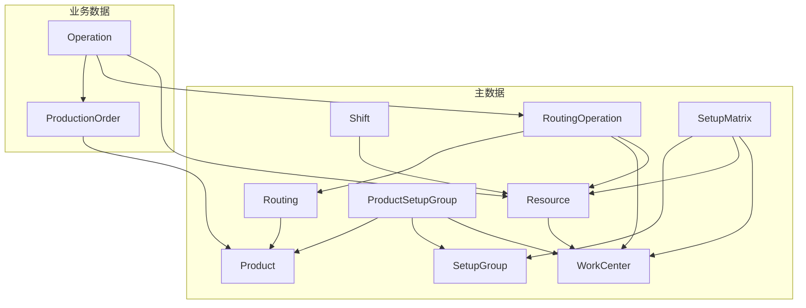

# 数据导入导出及删除

> APS 系统主数据与业务数据的 Excel 模板下载、数据导入、数据导出，以及可选择性的一键清空功能实现方案。

---

## 一、功能概述

| 功能     | 描述                                                         |
| -------- | ------------------------------------------------------------ |
| 模板下载 | 每种数据类型对应一个单独的 Excel 文件，下载时含表头 + 1 行示例数据 |
| 数据导出 | 将当前数据导出为 Excel                                        |
| 数据导入 | 上传 Excel 并按 code 做 upsert（存在则更新，不存在则创建）   |
| 一键清空 | 可选择清空某项数据或全部数据，按依赖顺序安全删除（在「数据库管理」页面操作） |

---

## 二、数据类型划分与依赖关系

**清空顺序（与依赖相反）：** Operation → ProductionOrder → ProductSetupGroup → SetupMatrix → RoutingOperation → Routing → Shift → Resource → WorkCenter, Product, SetupGroup

---

## 三、技术方案

### 3.1 后端实现

**新建模块** `backend/app/routers/data_management.py`，注册为 `/api/data-management`。

**依赖库**：`openpyxl`（Excel 读写），加入 `requirements.txt`。

**API 设计**：

| 方法 | 路径                     | 说明                                                     |
| ---- | ------------------------ | -------------------------------------------------------- |
| GET  | `/templates/{data_type}`  | 下载指定类型的 Excel 模板（含表头 + 1 行示例数据）        |
| GET  | `/templates`             | 获取所有支持的数据类型列表                               |
| POST | `/export`                | 导出：`{ data_types: ["work_centers","products",...] }`，返回 Excel |
| POST | `/import`                | 上传 Excel（multipart/form-data），指定 `data_type`      |
| POST | `/clear`                 | 清空：`{ data_types: ["work_centers",...] }` 或 `all: true` |

**数据类型枚举**：`work_centers`, `resources`, `shifts`, `products`, `routings`, `routing_operations`, `setup_groups`, `product_setup_groups`, `setup_matrix`, `production_orders`。

**模板设计原则**：

- **每种数据类型一个独立的 Excel 文件**，不合并多类型于同一文件
- 下载模板时：第一行为表头，第二行为 **一行数据示例**（供用户参考填写格式）
- 外键用 code 表示（如 `work_center_code` 而非 `work_center_id`）
- 日期格式统一为 `YYYY-MM-DD` 或 `YYYY-MM-DD HH:mm`

**导入逻辑**：

1. 解析 Excel，按列名映射到 schema
2. 用 code 查库：存在则 update，不存在则 create
3. 外键通过 code 解析为 id（如 `work_center_code` → WorkCenter.id）
4. 批量提交，返回成功/失败统计及错误明细

**清空逻辑**：

1. 校验 `data_types` 或 `all`
2. 按依赖顺序依次删除（如先 `operations`，再 `production_orders`，再主数据）
3. 清空主数据时，先清空依赖它的业务表和关联表
4. 使用事务，失败时回滚

### 3.2 前端实现

#### 3.2.1 各数据页面的导入/导出按钮

**在以下每个数据页面的工具栏或表头区域增加「下载模板」「导出」「导入」按钮**：

| 页面     | 文件                            | 对应数据类型                                           |
| -------- | ------------------------------- | ------------------------------------------------------ |
| 资源     | `DSResourceView.vue`            | work_centers, resources                                |
| 班次     | `ShiftsView.vue`                | shifts                                                 |
| 产品     | `DSProductView.vue`             | products                                               |
| 工艺路线 | `DSRoutingView.vue`             | routings, routing_operations                          |
| 切换矩阵 | `DSSetupMatrixView.vue`         | setup_groups, product_setup_groups, setup_matrix       |
| 生产订单 | `DSOrdersView.vue`              | production_orders                                      |

**按钮行为**（每个页面包含三个操作）：

- **下载模板**：`GET /templates/{data_type}` 下载该类型模板（含表头 + 1 行示例数据）。若页面对应多种类型（如资源页），则提供多个独立模板的下载入口。
- **导出**：`POST /export` 导出当前数据为 Excel（根据页面数据类型传 `data_type`）
- **导入**：`el-upload` 上传 Excel，指定 `data_type`，调用 `POST /import`

**资源页面**：因资源依赖工作中心，提供 `work_centers`、`resources` 两个独立的 Excel 模板下载；导出/导入时可分别操作，或导出时可选「仅资源」「仅工作中心」「二者」。

#### 3.2.2 数据库管理页面（清空数据）

**新建页面** `frontend/src/views/DataManagement.vue`，路由 `/data-management`。

**功能**：仅负责「清空数据」

- 数据列表（带依赖说明）
- 勾选要清空的数据类型
- 「清空选中」或「清空全部」
- 二次确认弹窗

**入口**：在 `frontend/src/App.vue` 左下角用户下拉菜单中，**在「修改密码」下方**增加「数据库管理」菜单项，点击后跳转 `/data-management`。建议仅对管理员可见（`is_admin`）。

**API 层**：在 `frontend/src/api/index.js` 中新增 `dataManagementApi`（模板下载、导出、导入、清空）。

---

## 四、模板字段定义（摘要）

| 数据类型             | 关键字段（code 为唯一键）                                                                 | 外键引用                                             |
| -------------------- | ----------------------------------------------------------------------------------------- | ---------------------------------------------------- |
| work_centers          | code, name, description                                                                   | -                                                    |
| resources             | code, name, work_center_code, capacity_per_day, efficiency                               | work_center_code                                     |
| shifts                | resource_code, shift_code, shift_name, start_time, end_time, break_time                   | resource_code                                        |
| products              | code, name, description, unit                                                             | -                                                    |
| routings              | code, name, product_code, version, is_active                                              | product_code                                         |
| routing_operations    | routing_code, sequence, name, work_center_code, resource_code?, setup_time, run_time_per_unit | routing_code, work_center_code, resource_code     |
| setup_groups          | code, name, description                                                                    | -                                                    |
| product_setup_groups  | product_code, setup_group_code, work_center_code?                                          | product_code, setup_group_code, work_center_code      |
| setup_matrix          | from_setup_group_code, to_setup_group_code, resource_code?, work_center_code?, changeover_time | from/to_setup_group_code, resource_code, work_center_code |
| production_orders     | order_number, product_code, quantity, due_date, earliest_start?, priority, order_type     | product_code                                         |

---

## 五、清空规则与保护

- **不删除**：`users` 表（用户）
- **清空全部**：按依赖顺序清空以上全部 10 类数据
- **清空单项**：若清空 `work_centers`，需同时清空 `resources`、`shifts`、`routing_operations` 中的工作中心引用、`product_setup_groups`、`setup_matrix` 等依赖项
- **建议**：清空前二次确认，并在接口返回将被删除的条数统计

---

## 六、实施顺序

1. 后端：新增 `data_management` 路由，实现模板生成、导出、导入、清空
2. 前端：`dataManagementApi` 与 `DataManagement.vue` 页面
3. 各数据页面：增加下载模板、导出、导入按钮
4. 集成：路由注册、用户菜单「数据库管理」入口、i18n 文案
5. 联调与测试：各数据类型导入导出、清空及依赖校验
