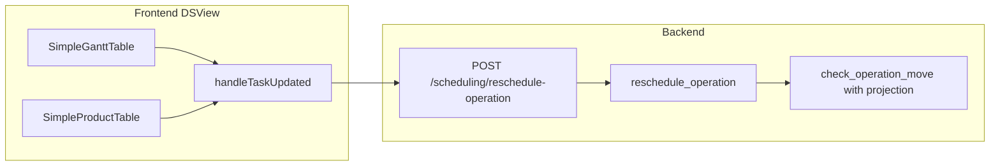

# 详细计划表：参照 SAP ePPDS 的手工拖拽排程方案

**文档说明**：详细计划表资源/产品甘特上的订单（工序）手工拖拽能力规划；对照 SAP ePPDS Detailed Planning Board。**交互**：条形图上按住鼠标左键拖动；**未保存计划**：采用 D1，须先保存或丢弃更改后再拖。

## 实施任务清单

| 序号 | 任务 | 状态 |
|------|------|------|
| 1 | 扩展 `check_operation_move`：对后续工序应用与 `reschedule_operation` 一致的偏移后再做顺序校验；跨资源时明确仅改当前工序 `resource_id` | 已完成 |
| 2 | `SimpleGanttTable`：根据落点 Y 解析目标 `resource_id`，`task-dragged` 传出 `newResourceId`；`DSView` 传入 `rescheduleOperation` | 已完成 |
| 3 | Shift+工序拖拽整单平移（`move_whole_order`）；未单独新增 `reschedule-order-block` 路由 | 已完成 |
| 4 | **已选定 D1**：存在未保存计划时禁止拖拽，须先「保存计划」或「丢弃更改」；保持 [DSView.vue](frontend/src/views/DSView.vue) 现有逻辑，**本轮不开发** | 不适用 |
| 5 | 补充 `invalid_resource`、投影校验相关错误的中英文案与手工测试用例 | 已完成（文案）；手工测试请在界面自测 |

---

## 1. 范围说明

- **目标界面**：详细计划表中的 **资源甘特**（[SimpleGanttTable.vue](frontend/src/components/SimpleGanttTable.vue)）与 **产品甘特**（[SimpleProductTable.vue](frontend/src/components/SimpleProductTable.vue)），二者均由 [DSView.vue](frontend/src/views/DSView.vue) 引用。
- **不在本轮默认范围**：路由页 [DSResourceView.vue](frontend/src/views/DSResourceView.vue) / [DSProductView.vue](frontend/src/views/DSProductView.vue)（主数据表格）；若需与主数据页联动，可作为后续单独立项。

### 1.1 拖拽交互约定（与实现一致）

- 在甘特图**时间轴区域**中，将**光标移到可拖工序条形图**上，**按住鼠标左键**并水平移动以调整排程时间，**松开左键**后根据新位置提交调整（与 `mousedown` / `mousemove` / `mouseup` 流程一致）。
- 不可拖条形图（生产订单、切换准备、无主数据等）不显示可拖样式或不响应上述操作；具体规则见组件内 `canDrag`。

## 2. 现状（已实现）

| 能力 | 实现位置 |
|------|----------|
| 条形图上**按住左键**横向拖拽、15 分钟取整、松开后提交 | `SimpleGanttTable` / `SimpleProductTable` 的 `onTaskBarMouseDown` → `emit('task-dragged', …)` |
| 落库调整 + 同订单后续工序按**相同时间偏移**平移 | [engine.py](backend/app/scheduler/engine.py) `reschedule_operation`（约 182–276 行） |
| 资源冲突、前后工序顺序、生产单禁止拖等 | [constraints.py](backend/app/scheduler/constraints.py) `check_operation_move` |
| 有未保存计划时禁止拖拽 | [DSView.vue](frontend/src/views/DSView.vue) `handleTaskDragged`（约 1438–1443 行）调用 `hasUnsavedChanges` 拦截 |

后端另有 [POST /scheduling/reschedule-with-links](backend/app/routers/scheduling.py) / `reschedule_with_links`，与单工序调整在**移动与校验**上基本一致（策略仅影响事后告警），**前端详细计划表当前未使用**。

## 3. 与 SAP ePPDS Detailed Planning Board 的主要差距

SAP 典型能力（抽象为需求）：

1. **订单块拖拽**：拖订单头/整单，使多道工序按规则一起移动（常等价于「锚点工序 + 后续联动」或「整单刚性平移」）。
2. **跨资源落行**：在资源视图中把工序拖到**另一条资源行**（需校验资源是否允许承接该工序）。
3. **校验与移动语义一致**：若引擎承诺「移动后联动平移后续工序」，则校验应基于**平移后的时间轴**（或等价投影），避免误拒合法拖拽。
4. **交互反馈**：拖拽过程幽灵条、非法落点提示、与产能/冲突的高亮（可选进阶）。
5. **与「计划版本/未保存更改」关系**：本方案**固定采用 D1**（见阶段 D），与 SAP「交互式计划直至确认」的差异接受为产品取舍；若将来需要预览态下拖拽，另立需求。

**关键代码层问题**：`check_operation_move` 在判断与**后道工序**关系时，用的是数据库中**尚未平移**的 `next_op.scheduled_start`（[constraints.py](backend/app/scheduler/constraints.py) 约 292–309 行），而 `reschedule_operation` 提交时会对后续工序加上相同 `offset_seconds`（[engine.py](backend/app/scheduler/engine.py) 约 266–275 行）。当用户把工序往后拖、新结束时间暂时「压住」后道工序的**旧**开始时间时，会被判为 `sequence_violation`，但联动平移后可能实际可行——这与 SAP 上常见的「拖一根条、整链跟着动」体验冲突，**应在方案中优先修正**。

## 4. 推荐实施阶段

### 阶段 A：后端语义与 API（优先，支撑所有拖拽模式）

1. **新增或扩展校验：带联动投影的 `check_operation_move`**
   - 在校验「被拖工序 vs 后道工序」时，对 `sequence > 当前工序` 且已排程的工序，将其 `scheduled_start/end` **加上与引擎一致的偏移量**（`new_start - old_start`）后再比大小；前道工序仍用库中实际时间（或同样规则若未来支持前移整链）。
   - 资源冲突：对被拖工序使用 `new_resource_id`；若发生**跨资源**，后续工序是否仍只在原资源上平移时间（当前实现）还是跟随，需在业务上写清；**默认保持现有「仅时间平移、不改后续资源」**，跨资源只改当前 `operation.resource_id`。
2. **（可选）显式 `POST /scheduling/reschedule-order-block`**
   - 入参：`order_id`、`anchor_operation_id` 或 `delta_seconds`、`optional_new_resource_id`（仅锚点工序）。
   - 内部：统一计算偏移、批量更新、同一事务提交；与单工序接口复用投影校验，减少重复逻辑。
3. **跨资源合法性**
   - 当前 [Operation](backend/app/models.py) 绑定 `routing_operation_id` 与 `resource_id`，无「多可选资源」表。可落地规则 v1：**仅允许拖到与 `RoutingOperation.resource_id` 同一 `work_center` 下的资源**（通过 Resource → WorkCenter 关联查询），否则返回明确 `violation_type`（如 `invalid_resource`）。后续若有替代资源主数据再放宽。

### 阶段 B：资源视图 — 跨行拖拽

1. **数据结构**：`SimpleGanttTable` 的 `flattenedData` 中分组行应对应 `resource_id`（或可从子行聚合得到），用于 **Y → 目标 resource_id**。
2. **交互**：在 `mousemove` 中根据纵坐标命中哪条「子任务行」对应的**资源分组**或同行资源 ID；`mouseup` 时若 `targetResourceId !== item.resource_id`，则随 `task-dragged` 传出 `newResourceId`。
3. **DSView**：`handleTaskUpdated` 将 `newResourceId` 传给现有 `schedulingStore.rescheduleOperation`（已支持 `new_resource_id`）。
4. **产品视图**：行语义是产品而非资源；**默认不做跨产品落行**（避免误把工序挂到错误产品）。若未来需要「按产品视图改资源」，可单独加「资源选择器」而非拖放到另一产品行。

### 阶段 C：订单级拖拽（贴近 SAP「拖订单」）

1. **UI**
   - 在资源/产品甘特**订单分组行**（`isGroup`）上增加可拖区域，或 **Shift + 拖工序** 表示「以该工序为锚点，联动偏移整单已排程工序」（与现有后端联动一致）。
2. **后端**
   - 优先复用阶段 A 修正后的单工序接口 + 现有 successor 平移；若需「所有工序（含锚点前的）整体平移」，再在阶段 A 的 block API 中实现 `delta` 应用到全单。
3. **一致性**：与 `reschedule-with-links` 对齐是否合并为一条推荐 API，避免双轨维护。

### 阶段 D：体验与规则（SAP 风格增强）

1. **未保存更改与拖拽（已锁定方案 D1）**
   - **维持现状**：当 `hasUnsavedChanges === true` 时**禁止**甘特拖拽；用户须先执行「保存计划」或「丢弃更改」后再调整工序。对应 [DSView.vue](frontend/src/views/DSView.vue) 中 `handleTaskDragged` 对 `hasUnsavedChanges` 的拦截，**本轮无需改动**。
   - **不在本轮范围**：在预览/未保存状态下直接拖拽并写入缓存（原方案 D2）不作为本方案交付内容；若后续需要，单独立项。
2. **视觉**：拖拽中半透明条、非法落点红色描边、成功后短动画（可选）。
3. **无障碍与设备**：在 `mousedown` 并列增加 `pointerdown`/`pointermove`/`pointerup`（或统一 Pointer Events），便于触摸屏车间场景。

## 5. 验收要点（可执行检查清单）

- 拖**中间工序**向后较大跨度：在联动平移语义下，**不应**仅因「新结束时间大于后道工序旧开始时间」而失败（阶段 A 修复后验证）。
- 资源视图：将工序拖到**同工作中心**另一资源成功；拖到非法资源有明确错误文案（中英 [i18n](frontend/src/i18n/zh-CN.js)）。
- 产品视图：单工序横向拖拽在修复后行为与资源视图一致；跨行行为未启用时不回归。
- 生产订单、切换准备条、无 `operation_id` / 无 `run_time` 的条仍不可拖（保持 [canDrag](frontend/src/components/SimpleGanttTable.vue) 规则）。
- **D1**：存在未保存更改时尝试拖拽应被提示并拒绝，保存或丢弃后可正常拖拽；与「保存计划 / 丢弃更改」流程无矛盾。

## 6. 风险与依赖

- **校验与联动**若不一起改，订单级拖拽和「大跨度」横拖会持续难用。
- **跨资源**若无工作中心数据或 Resource 未关联 WorkCenter，需定义兜底规则（例如仅允许 `routing_operation.resource_id` 本身）。
- SAP 的 pegging、有限产能下自动挤压相邻单等属于更高阶能力，可在阶段 D 之后单独立项。
