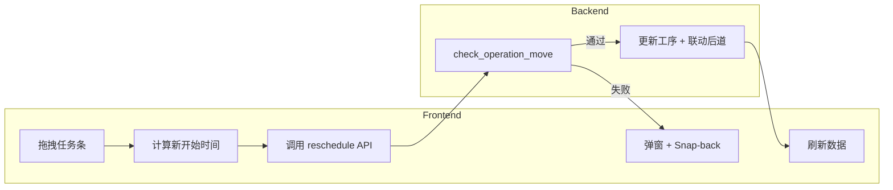

# 订单拖拽调整功能 — 实现方案

## 1. 功能概述

在详细计划表的**资源视图**和**产品视图**中，通过 UI 界面拖拽工序条以调整计划。拖拽时需满足以下约束：

1. **前序工序约束**：订单不能先于其前序工序的「最早结束时间」开始  
2. **禁止重叠**：若拖入位置已有订单，系统禁止放入，弹窗提示「资源不可用」并回弹（Snap-back）

---

## 2. 现状分析

### 2.1 前端

- `SimpleGanttTable.vue`（资源视图）和 `SimpleProductTable.vue`（产品视图）目前为纯展示组件，任务条为静态 div，**无拖拽能力**
- `DSView.vue` 中有 `handleTaskUpdated`，但未与甘特图组件联动

### 2.2 后端

- 已有 `POST /scheduling/reschedule-operation` 接口
- `ConstraintValidator.check_operation_move` 已实现：
  - 前序工序校验：`prev.scheduled_end > new_start` 时返回 `sequence_violation`
  - 重叠校验：时间区间重叠时返回 `resource_conflict`
- 甘特图任务数据中包含 `operation_id`，可直接用于调用 API

---

## 3. 实现方案

### 3.1 拖拽实现方式

使用原生 `mousedown` / `mousemove` / `mouseup` 实现**水平拖拽**（仅调整时间，不改变资源）。

- 可拖拽对象：子任务条（非资源/产品行），且必须有 `operation_id`
- 拖拽时：记录原始 `start_date`，根据鼠标偏移计算新开始时间
- 最终校验由后端完成

### 3.2 时间与坐标转换

```
新开始时间 = firstDay + (pixelOffset / dayWidth) × 24 小时
```

- `firstDay`：时间轴首日
- `dayWidth`：根据 `zoomLevel` 确定每天像素宽度
- 需考虑 `scrollLeft` 等滚动偏移

### 3.3 错误与提示

| 违反类型       | 后端 violation_type   | 前端提示文案             |
| ------------ | -------------------- | -------------------- |
| 与前序工序冲突    | `sequence_violation` | 不能早于前序工序结束时间         |
| 与同资源工序重叠  | `resource_conflict`  | 资源不可用               |
| 其他           | -                    | 使用后端返回的 message |

### 3.4 Snap-back 实现

- 不采用乐观更新：拖拽中仅更新预览位置
- 放置后调用 API：
  - **成功**：刷新数据
  - **失败**：弹窗提示 + 任务条回弹到原位置（可用 CSS `transition` 做回弹动画）

### 3.5 禁止拖拽的场景

- 资源行、产品行（分组行）
- 无 `operation_id` 的任务
- 生产订单（`order_type === 'production'`）
- 存在未保存启发式结果时：提示「请先保存或丢弃当前计划后再调整」
- 切换准备条（`task_type === 'changeover'`）：仅主工序条可拖拽

### 3.6 配置项（可选扩展）

需求中「根据配置选择」可扩展为：

- `overlapPolicy`: `'forbid'`（禁止放入 + 回弹）| `'allow'`（允许重叠，仅警告）
- 默认实现为 `'forbid'`

---

## 4. 数据流



---

## 5. 文件改动清单

| 文件 | 改动内容 |
|------|----------|
| `SimpleGanttTable.vue` | 为子任务条添加拖拽、预览及 `@task-dragged` 事件 |
| `SimpleProductTable.vue` | 同上 |
| `DSView.vue` | 监听 `task-dragged`，调用 `rescheduleOperation`，处理成功/失败及提示 |
| i18n | 新增「资源不可用」「不能早于前序工序结束时间」「请先保存或丢弃当前计划」等文案 |

---

## 6. 实现步骤建议

1. 在 `SimpleGanttTable.vue` 实现任务条拖拽，`mouseup` 时 emit `task-dragged`
2. 在 `DSView.vue` 处理事件：检查 `hasUnsavedChanges`，调用 `rescheduleOperation`，成功则刷新，失败则弹窗 + Snap-back
3. 将相同逻辑复用到 `SimpleProductTable.vue`
4. 处理 `new_start` 落在 `dateRange` 内、时间取整（如 15 分钟）等边界
5. 补充 i18n 文案
