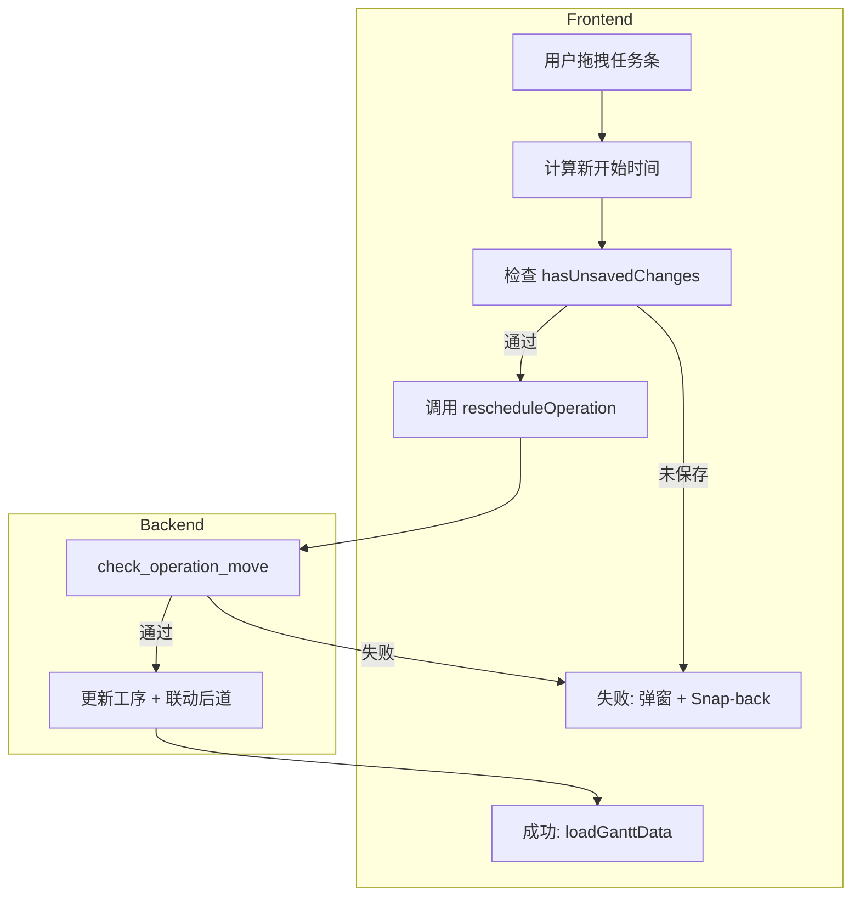

# 详细计划表订单拖拽调整 — 实现方案

## 一、SAP EPPDS DS Board 参考

SAP 详细计划规划板（DS Planning Board）的拖拽行为：

- **水平拖拽**：将计划订单拖至同资源上的不同日期/时间
- **手动重排**：解决排序或时间冲突
- **模拟态**：在保存前为模拟变更，保存后才落库
- **交互**：图形化展示，支持拖拽调整和多种排程函数

本方案在 DS 资源视图和产品视图中实现类似能力：水平拖拽工序条、后端校验、失败回弹。

---

## 二、现状与依赖

### 已就绪

| 组件 | 说明 |
|------|------|
| `backend/app/routers/scheduling.py` | `POST /scheduling/reschedule-operation` 接口 |
| `backend/app/scheduler/constraints.py` | `check_operation_move`：前序工序、资源重叠校验 |
| `frontend/src/views/DSView.vue` | `handleTaskUpdated` 已实现，但未与甘特图组件打通 |
| `frontend/src/components/GanttChart.vue` | dhtmlx-gantt 拖拽实现可作参考 |

### 需实现

- `SimpleGanttTable.vue`、`SimpleProductTable.vue` 为纯展示，任务条为静态 div，无拖拽
- DSView 需监听拖拽事件并调用 `rescheduleOperation`

### 任务数据结构

甘特任务包含 `operation_id`、`resource_id`、`start_date`、`end_date`、`work_hours` 等，可直接用于接口调用。

---

## 三、实现方案

### 3.1 拖拽设计（参考 SAP DS Board）

- **水平拖拽**：仅调整时间，不跨资源
- **可拖拽**：子任务条（工序），且 `operation_id` 存在
- **不可拖拽**：资源/产品分组行、无 `operation_id`、生产订单、切换准备条、存在未保存启发式结果时

### 3.2 实现方式

采用原生 `mousedown` / `mousemove` / `mouseup` 实现水平拖拽（SimpleGanttTable/SimpleProductTable 为自定义 div，非 dhtmlx-gantt）：

- **时间与像素**：`新开始时间 = firstDay + (pixelOffset / dayWidth) × 24 小时`
  - `firstDay`：时间轴首日
  - `dayWidth`：由 `zoomLevel` 决定（0=480px, 1=240px, 2=120px, 3=40px, 4=20px）
  - `pixelOffset`：需包含 `rightContentRef.scrollLeft`
- **时间取整**：建议按 15 分钟取整，避免 00:01 等异常时间
- **放置后**：调用 `rescheduleOperation`，不做乐观更新

### 3.3 错误与提示

| 违反类型 | 后端 violation_type | 前端提示 |
|----------|---------------------|----------|
| 前序工序冲突 | `sequence_violation` | 不能早于前序工序结束时间 |
| 资源重叠 | `resource_conflict` | 资源不可用 |
| 其他 | - | 使用后端返回的 message |

### 3.4 Snap-back

- 拖拽中：仅更新预览位置（可选：半透明克隆条跟随鼠标）
- 放置后：调用 API
  - 成功：`loadGanttData()` 刷新
  - 失败：弹窗提示 + 任务条回弹（CSS `transition`）

### 3.5 数据流



---

## 四、文件改动

### 1. SimpleGanttTable.vue

- 为子任务条 `.task-bar`（非 `item.isGroup`）添加 `mousedown` 启动拖拽
- 拖拽中：根据 `mousemove` 计算预览位置，可选克隆条
- `mouseup`：计算 `new_start`，`emit('task-dragged', { operationId, newStart, resourceId, originalStart })`
- 不可拖拽：`item.isGroup`、无 `operation_id`、`order_type === 'production'`、`task_type === 'changeover'`
- 添加 `cursor: grab` / `grabbing`、拖拽禁用 `user-select`

### 2. SimpleProductTable.vue

- 复用 SimpleGanttTable 的拖拽逻辑（可抽取 composable）
- 产品视图子任务来自不同资源，需从 `item.resource_id` 传入 API

### 3. DSView.vue

- 在 `SimpleGanttTable` 和 `SimpleProductTable` 上监听 `@task-dragged`
- 处理逻辑：
  - 若 `hasUnsavedChanges`：提示「请先保存或丢弃当前计划后再调整」，不调 API
  - 否则：`handleTaskUpdated(data)` → `rescheduleOperation(operationId, newStart, resourceId)`
  - 成功：`loadGanttData()`
  - 失败：`ElMessage.error(trMsg(result.message))`，刷新或由组件内部回弹

### 4. 复用 handleTaskUpdated

DSView.vue 中已有 `handleTaskUpdated`（约 1216 行），需适配 `task-dragged` 的 payload：

```js
// task-dragged  payload: { operationId, newStart, resourceId, originalStart }
// handleTaskUpdated 期望: { operationId, newStart, resourceId }
```

保持 `handleTaskUpdated` 签名，在 `@task-dragged` 中传入适配后的对象即可。

### 5. i18n

- `dsView.resourceUnavailable`: 资源不可用
- `dsView.cannotBeforePrevOperation`: 不能早于前序工序结束时间
- `dsView.saveOrDiscardFirst`: 请先保存或丢弃当前计划后再调整

---

## 五、可提取的 composable（可选）

为减少重复，可建 `useGanttTaskDrag.js`：

- 输入：`dayWidth`、`timeAxis`、`rightContentRef`、`dateRange`
- 输出：`{ onMouseDown, onMouseMove, onMouseUp, draggingTask, dragPreviewLeft }`
- 内含：像素↔时间换算、15 分钟取整、拖拽状态

SimpleGanttTable 与 SimpleProductTable 共用该 composable。

---

## 六、实现步骤建议

1. 在 SimpleGanttTable.vue 实现任务条拖拽，并在 `mouseup` 时 `emit('task-dragged')`
2. 在 DSView.vue 中绑定 `@task-dragged`，并连接 `handleTaskUpdated`，处理成功/失败与刷新
3. 将相同逻辑迁移到 SimpleProductTable.vue（或通过 composable 复用）
4. 处理 `new_start` 落在 `dateRange` 外、时间取整等边界情况
5. 补充 i18n 文案并测试各种违规场景的提示与回弹
